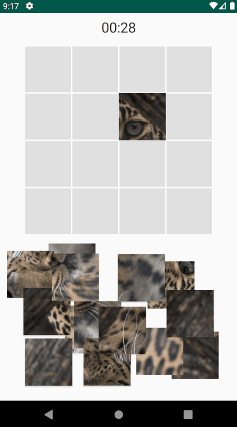
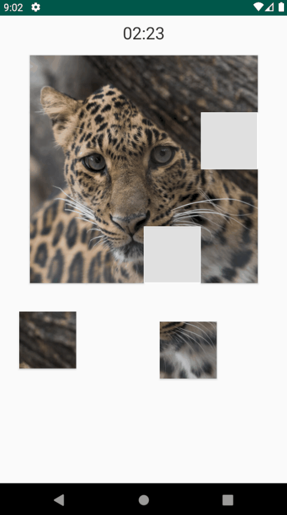
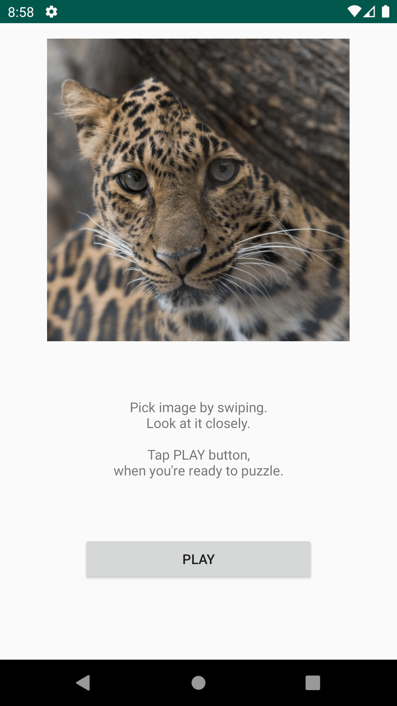
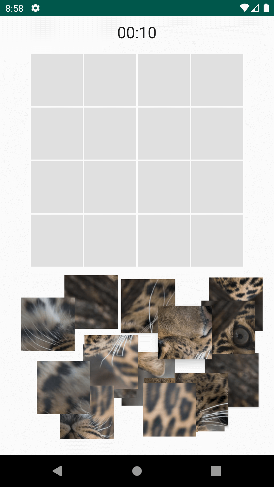
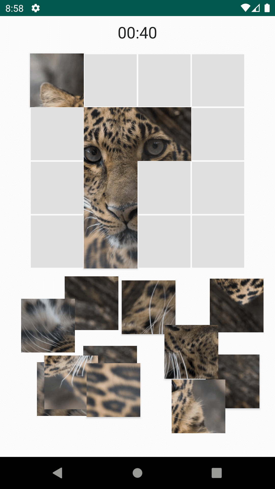
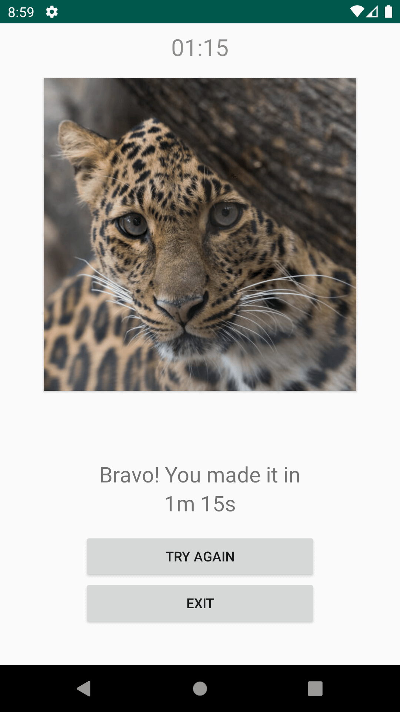
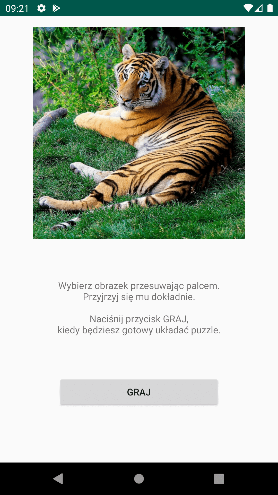
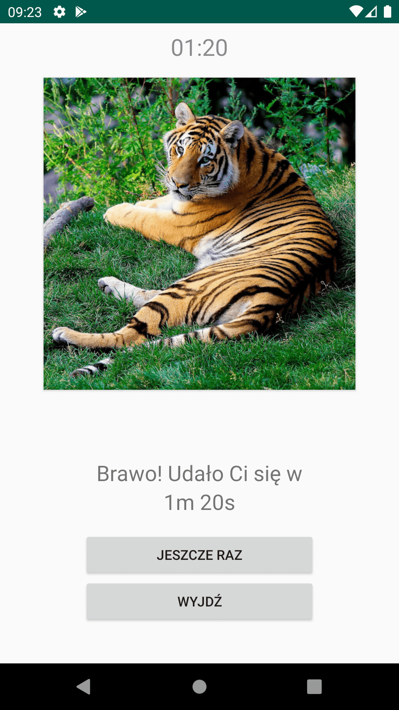

# Puzzle Game

Native Android puzzle game - put wild cats' images together!

 

## How to play

1. Tap to rotate puzzle
2. Drag and drop to place puzzle on the grid

## Try it

1. [Download](https://github.com/dbpienkowska/puzzle-game/raw/master/apk/PuzzleGame-debug.zip)
2. Unpack
3. Install apk
4. Play

## Screenshots

 
 

## Extras

Polish language available!

 
